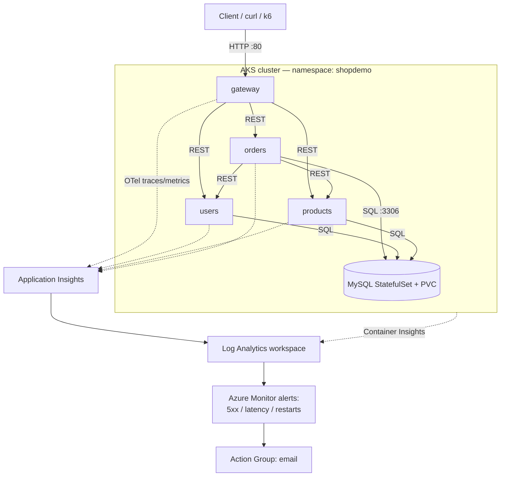
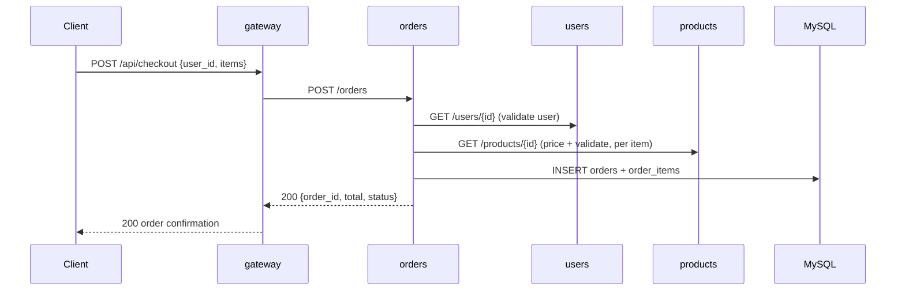
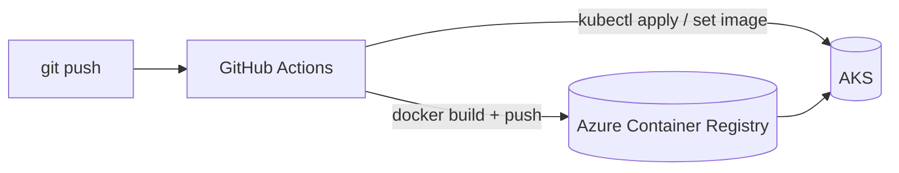

# Architecture — SRE Agent Demo (Shop on AKS)

## Overview

This is a small e-commerce ("shop") application built as **four FastAPI
microservices** plus an **in-cluster MySQL** database, running on **Azure
Kubernetes Service (AKS)**. It is intentionally simple but realistic enough to
demonstrate how the **Azure SRE agent** detects and diagnoses a production
regression.

## Components

| Component | Responsibility | Kind | Exposure |
|---|---|---|---|
| `gateway` | Public backend-for-frontend; routes/aggregates calls | Deployment | `LoadBalancer` |
| `users` | Customer profile lookups | Deployment | `ClusterIP` |
| `products` | Product catalog lookups | Deployment | `ClusterIP` |
| `orders` | Validates user + products, computes totals, writes orders | Deployment | `ClusterIP` |
| `mysql` | Relational store for users, products, orders | StatefulSet + PVC | headless `ClusterIP` |

All services run in the `shopdemo` namespace.

## System diagram

## Checkout request flow

The checkout path is the most interesting one, fanning out to `users`,
`products`, and MySQL before confirming the order.

## Networking & service discovery

- Internal services are reached by Kubernetes DNS names (`http://users`,
  `http://products`, `http://orders`) on port `80`, mapped to container port
  `8000`.
- Only `gateway` is exposed publicly via a `LoadBalancer` service.
- MySQL is a headless service (`mysql:3306`) backed by a single-replica
  StatefulSet with a `PersistentVolumeClaim`.

## Configuration & secrets

- **ConfigMap `app-config`** — service URLs, DB host/port/name, HTTP timeout.
- **Secret `app-secret`** — MySQL credentials and the
  `APPLICATIONINSIGHTS_CONNECTION_STRING` used for tracing export.
- **ConfigMap `mysql-initdb`** — schema + seed data, mounted into the MySQL
  container's init directory (runs once on first startup).

## Reliability features

Each application Deployment includes:
- **Liveness probe** (`GET /healthz`) and **readiness probe** (`GET /readyz`,
  which checks DB connectivity for data services).
- **Resource requests and limits** (CPU/memory).
- **HorizontalPodAutoscaler** (CPU target 70%, 2–5 replicas).
- Multiple replicas for the stateless services.

## Observability

- **OpenTelemetry** auto-instruments FastAPI (incoming), HTTPX (service-to-service)
  and PyMySQL (database) in every service.
- Telemetry is exported to **Application Insights** via the Azure Monitor
  OpenTelemetry distro, giving end-to-end **distributed traces** across the
  checkout flow.
- **Container Insights** streams cluster/pod metrics and logs to the same **Log
  Analytics** workspace.
- **Azure Monitor alert rules** watch the 5xx rate, checkout p95 latency, and pod
  restarts.

## CI/CD

- Triggered on push to `main` and `release/v2`.
- Builds and pushes all four images to ACR tagged with the Git SHA.
- Applies manifests and waits for rollouts.
- Authenticates with a service principal (`AZURE_CREDENTIALS` secret).

## Branches

- **`main`** — the baseline of the application.